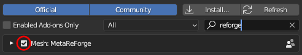
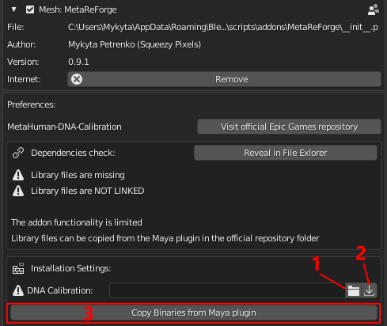
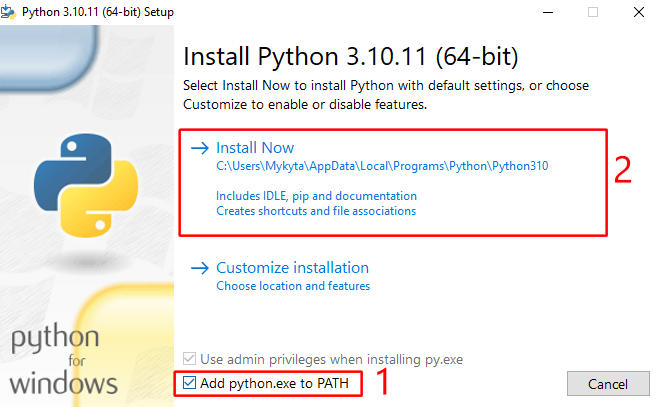
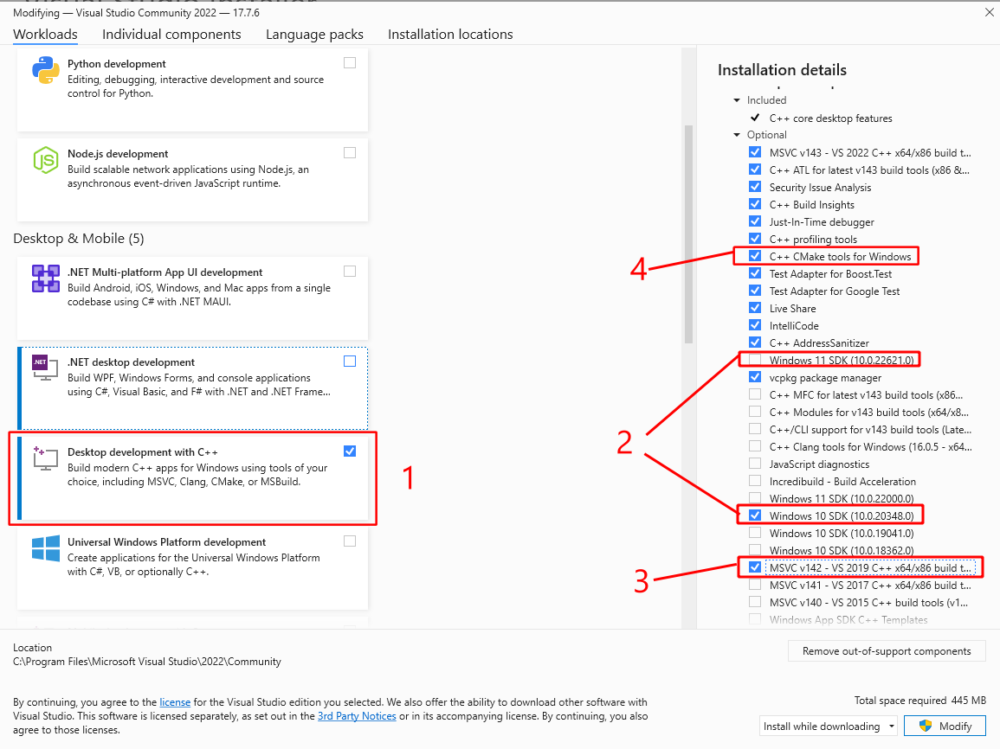

# Installation Guide

### System support
- Currently, the MetaReForge supported for **Windows only**. We will extend the list of supported systems if there is a demand for it. Our code itself is generally cross-platform, but we have not tested the Add-on on other platforms, so we cannot guarantee that it will work smoothly or even work at all.
- Blender 4.0 is not fully supported. It works, but some actions take extremely long ('Synchronize' takes ~10 minutes in Blender 4.0 vs 10-15 seconds in Blender 3.6)

### Important note
**Run Blender with administrator privileges when you install the add-on and build the library!**

### 1. Installing MetaReForge Bledner Add-on


The basic installation of the MetaReForge add-on is no different from installing any other Blender Add-on. The following steps need to be taken:
1.  Edit -> Preferences -> Add-ons
2. Click "Install"
4. Select MetaReForge zip
5. Click "Install Addon"
6. Activate the add-on.

<p align="center">
  
</p>

**Important Note**

However, to get full functionality, it is necessary to **link MetaReForge with the Metahuman DNA Calibration Library** by Epic Games, through which MetaReForge can access reading and writing operations of the proprietary DNA format. For example, you can update neutral joint transforms, as the neutral pose from an FBX file is unfortunately ignored by animation blueprints.

In general, a DNA file determines how controls will transform joints, adjust corrective morph targets, animate texture maps, and more. This makes Metahuman one of the most realistic digital characters, especially in terms of facial animations.

### 2. How to link MetaReForge to Metahuman DNA Calibration
[Metahuman DNA Callibration Library](https://github.com/EpicGames/MetaHuman-DNA-Calibration) does not contain pre-built binaries for most recent blender versions, so you can either download older blender builds (for example [Blender 3.3.7 LTS with python 3.9](https://blender.community/c/graphicall/egnl/)) or build your own binaries for your target system.

**MetaReForge** comes with a usefull build util, that make the process a bit easier for regular user, but it still requires some general knowledge and skills. Thanks for your patience.

In the next two sections I will show you both options

### 2.1. Using Blender with python 3.9
**[See on YouTube](https://youtu.be/fMJvKigpV9s)**

The easiest way to connect the library is to use a version of Blender built on Python 3.9. Yes, we don't get the very latest version with all the new features (but, by the way, DNA-Calibration doesn't have prebuilt binaries for the latest version of Maya at the time of writing this documentation either...), but the installation process takes minimal time.Before installing MetaReForge you need to download:

- Blender with Python 3.9 support (for example [Blender 3.3.7 LTS - Python 3.9 - Windows](https://blender.community/c/graphicall/egnl/) from the blender community builds)
- MetaReForge Add-on (zip)
- [Metahuman-DNA-Calibration 1.2.0 release](https://github.com/EpicGames/MetaHuman-DNA-Calibration/releases/tag/1.2.0)

Step-by-step Installation Instructions
1. Install/unzip compatible Blender with python 3.9 support
2. Unpack the Metahuman-DNA-Calibration archive.
3. Install MetaReForge (see [Section 1](#installing-metareforge-bledner-add-on))
4. Expand the add-on preferences, specify the path to any temporary folder for download (*1*), click download (*2*), click **"Copy Binaries from Maya plugin"** (*3*). The "Library files are missing" check should change to "Librart files are found".

    **Note:** You can directly specify the path to the DNACalibration root skipping (*2*) if you already have it, instead of downloading it.
<p align="center">
  
</p>


5. Restart Blender. Go back to the add-on settings. Two checks should be passed: "library files are found", "library files are linked".

Enjoy using the add-on. These steps only need to be done once.


### 2.2. Building DNA Calibration binaries for different python versions
**[See on YouTube](https://youtu.be/1A_jdwr05kI)**

Compiling Metahuman DNA Calibration is not a very complicated process. All that is required from you is the ability to follow instructions and a bit of patience. I tried to describe the process in as much detail as possible and even automate it a bit. Even someone who is not familiar with programming at all can handle it. For those who develop in C++ in Unreal Engine, this step will seem like a walk in the park.

The advantage of this approach is that by spending just 10 minutes of your time, you will be using the Add-on with the latest version of Blender and all its new features.
#### 2.2.1. Preparation
First, you need to prepare. It's important to know which version of Python your Blender uses, because it is the main reason for incompatibility with pre-built binaries from Epic's github repository.
You can check this in the Python Console.
If Blender is set to default, then in the Scripting tab on the left side, you will see the interactive Python Console which displays information about Python. Otherwise you may set any current editor type to "Python Console" (Shift + F4).

```
PYTHON INTERACTIVE CONSOLE 3.10.13 (main, date) [MSC v.1928 64 bit (AMD64)]
                           |  |  |                      |    |        |           
          Major Version ───┘  |  |                      |    |        |
          Minor Version ──────┘  |                      |    |        |
          Micro Version ─────────┘                      |    |        |
                              Toolset/Compiler used ────┘    |        |
                              Bit-version ───────────────────┘        |
                              Architecture (Processor type) ──────────┘
```
Firstly, we are interested in the major and minor versions of Python, as well as the bit-version, and the toolset/compliler used during the compilation of the Python interpreter. The micro version is not as important, but it is recommended to use the closest one. 
#### 2.2.2. Installing Python
Python can be downloaded from the official website [python.org](https://www.python.org/downloads/). If you have Python 3.10.13, it would be perfect to use the same Python library when compiling the DNA Calibration Library. However, when you try to get an installer for the exact version, the installer may not be available, and the text on the release page will say:

> **No installers**
>
>According to the release calendar specified in PEP 619, Python 3.10 is now in the "security fixes only" stage of its life cycle: 3.10 branch only accepts security fixes and releases of those are made irregularly in source-only form until October 2026. Python 3.10 isn't receiving regular bug fixes anymore, and binary installers are no longer provided for it. Python 3.10.11 was the last full bugfix release of Python 3.10 with binary installers.


From the text, we can understand which version is available with an easy-to-use installer and get it. A different micro version is okay. So we may get Python 3.10.11 as the lates available with installer.
Make sure that you download the installer for the right bit-version (64-bit in most cases).

Run the downloaded Python installer. During installation, it is **ESSENTIAL** to add the path to the Python executable files to the system PATH variable by checking the appropriate box.

<p align="center">
  
</p>

#### 2.2.3. Installing C/C++ Compiler

The next crucial step is the installation of a C/C++ compiler. Without delving into the details, the compiler should be similar to the one used for compiling the Python interpreter. For Windows, this is Microsoft Visual C++ (MVC).
```
MSC v.1928 64 bit
``````
The number "1928" indicates the version of the Microsoft C/C++ optimizing compiler and linker tools. This version number helps you identify the corresponding MSVC toolset version.

Here's a brief mapping for reference:

- MSC v.**190**X → MSVC toolset version **140** (Visual Studio 2015)
- MSC v.**191**X → MSVC toolset version **141** (Visual Studio 2017)
- MSC v.**192**X → MSVC toolset version **142** (Visual Studio 2019)
- MSC v.**193**X → MSVC toolset version **143** (Visual Studio 2022)

Fortunatelly, all 14x MSVC releases have a stable ABI, and binaries built with these versions can be mixed in a forwards-compatible manner.

So generally for python 3.10 built with MSC v.1928 we can use either MSVC 142 (as the closest) or MSVC 143 (as the latest).

The compiler can be installed from [Visual Studio](https://visualstudio.microsoft.com/downloads/) or from Visual Studio Build Tools (if you are not going to use IDE)

When you install either Visual Studio or Build Tools you will configure components in Visual Studio Installer.

You need to:
- Tick "Desktop development with C++"
- Choose Windows SDK for your platform (Win 10 or 11)
- Optionally you can tick MSVC 142 (MSVC 143 is ticked by default)
- Make sure that option "C++ CMake Tools for Windows" is also ticked

<p align="center">
  
</p>

#### 2.2.4. Installing Swig (Can be done from Blender)

- Download Swig for windows from [Swig Downloads](https://www.swig.org/download.html)
- Extract archive

**Note:** It is not necessary to do this step manually. It can be done in one click from Blender.

#### 2.2.5. Build

When the MetaReForge add-on is installed and activated, we move to the add-on preferences. You should see messages indicating "Library files are missing" and "Library files are NOT LINKED", meaning that the DNA Calibration Library is not connected. Next, you need to go through the compilation settings.

The first important parameter is the path to the **CMake utility**. If you installed CMake with Visual Studio following the instructions in section 2.2, then the path to CMake should be detected automatically. You should also see a checkmark on the left indicating that the executable file has been found.

The next step is to set the path to the **Swig utility**. If you have downloaded and unpacked it, then specify the path to the root of this utility. A checkmark should appear on the left.
If you haven't installed it, you can instead specify the path to the directory where you want to download and unpack Swig (for example, “C:/temp/”) and press the download button. After that, the path to Swig will update automatically and will point to the root directory into which the utility was unpacked.

Next, you need to specify the path to the **DNA Calibration Library**. Similarly to Swig, you can either specify the path to a previously downloaded and unpacked library or specify the path where you want to download it and press the download button. This gives us the third checkmark.

Final touches. You need to select the version of Python. By default, at the first launch of the add-on, it will attempt to identify the most suitable version from those installed on the computer. More about choosing the Python version was in [section 2.2.2](#222-installing-python).

Next, you need to select the C++ toolset/compiler. By default, it will be set to v143 with which everything should work, but optionally you can use v142 if you additionally installed it in Visual Studio. More about choosing the version of the toolset was in [section 2.2.3](#223-installing-cc-compiler).

Click **"Build DNA-Calibration"**, wait a couple of minutes and it's done. Now the "Library files are missing" should change to "Library files are found". The last thing left to do is to restart Blender and see the message "Library files are linked" instead of "NOT LINKED".

These actions need to be done only once. You can also save the files and directories located at `<PATH_TO_METAFORGE_ADDON>/third_party/dnacalib/`. To easily access this location, go to the add-on settings and use **"Reveal In File Explorer"**. This action will open the folder in the file explorer, allowing you to back up the necessary files. When updating Blender or reinstalling the operating system, if the Python version remains compatible, you won't need to repeat these steps; simply place the saved files back in the required directory of the add-on.

**However**, it's important to note that these files can be reused only if the Python version remains compatible. Specifically, the files are compatible if the first two numbers of the Python version (major and minor version numbers) remain the same after the Blender update. This compatibility is crucial for the proper functioning of the add-on with the new version of Blender.


