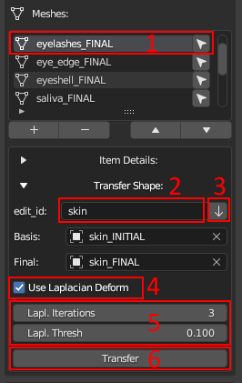

# Transfer Shape to Minor Meshes (Deprecated)

```eval_rst
.. important::
    This is how to transfer changes to minor meshes in versions 1.1.0.X. In 1.1.1.X the process was changed
```

#### How to transfer defromation from one edit object to another (eyeshels, eyelashes etc.)
To transfer deformations, you need 
1. to select the necessary item from the list (_**1**_, see figure) to which you want to transfer the deformations. 
2. Next, you need to set up the transfer. You can specify the basis and final objects manually or, as shown in the figure: enter the edit_id of the mesh from which the deformations will be transferred (_**2**_, see figure) and press the arrow button (_**3**_, see figure). If everything is specified correctly, then the basis and final objects should be determined automatically.
3. By default, the surface deform modifier will be used to transfer changes (in short, the vertices of the mesh will be attached to the closest polygons of the source mesh. [Learn more](https://docs.blender.org/manual/en/latest/modeling/modifiers/deform/surface_deform.html)). In some cases, it may not work as well as desired, for example, it may warp or significantly stretch the shape of the original objects, so an option with enabling the Laplacian deform (_**4**_, see figure) has been added (in brief, this modifier keeps the anchor vertices in fixed positions and calculates the optimal locations of all the remaining vertices to preserve the original geometric details. [Learn more](https://docs.blender.org/manual/en/latest/modeling/modifiers/deform/laplacian_deform.html)). In this case, points that are closer than "Lapl. Thresh." (_**5**_, see figure) to the mesh from which the transformations are transferred will be transferred using surface deform (attached to the surface), and points that are further will be reconstructed using Laplacian deform. **For example**, when transferring deformations from the main body mesh to the eyelashes, the roots of the eyelashes will be attached to the nearest polygons on the eyelids, while the rest of the eyelash will not be directly attached to the body but will try to preserve the original shape of the eyelash as much as possible taking into account the new location of the eyelash root.
4. Click transfer (_**6**_, see figure)
5. Revise the changes after the transfer and fix minor problems.

<a href="./images/transfer_edit_shape.png">
  <p align="center">
    
  </p>
</a>

Despite the lengthy description, the process is simpler than it seems. **The skin, teeth, and eyes are edited manually based on your artistic needs.** The deformation is transferred to the other objects. For simplicity, we have compiled the following recommendations to help you quickly get oriented:

1. **Saliva** - Transfer the deformation from "teeth" with disabled Laplacian deform.
2. **Eyeshell** - Transfer the deformation from "skin" with Laplacian Deform enabled (thresh >= 0.01).
3. **Eyelashes** - Transfer the deformation from "skin" with Laplacian Deform enabled (thresh >= 0.1).
4. **Eye Edge, Cartilage** - Transfer the deformation from "skin" with Laplacian Deform disabled.
