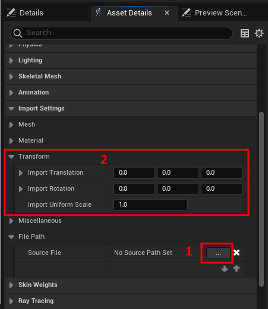
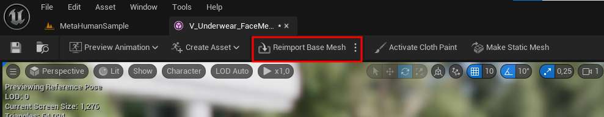
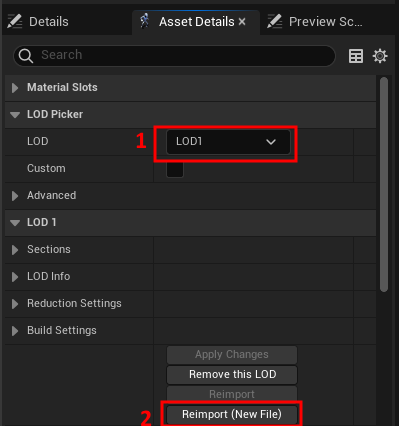

# Reimport Metahuman in Unreal Engine
```eval_rst
.. important::
    - In our workflow, we highly recommend reimporting instead of simple importing. This approach slightly reduces the time needed for subsequent setup.
    - We also recommend making a duplicate of the original skeletal mesh before making any changes.
```

There are 4 steps
1. **Open the Skeletal Mesh to Modify.** Open the Skeletal mesh that you intend to modify.
2. **Import Settings.** To reimport the base mesh, it's necessary to set the path to the new FBX file. Then, check the transformations. All Translation and Rotation components should be set to zero, and Scale should be 1.
   <a href="./images/ue_import_settings.png">
      <p align="center">
         
      </p>
   </a>
3. **Reimport Base Mesh.** Then click "Reimport Base Mesh" at the top. Be aware that this process can be time-consuming due to the large number of shape keys involved. 
   <a href="./images/reimport_base_mesh.png">
      <p align="center">
         
      </p>
   </a>
4. **Reimport the Remaining LODs (if necessary for your project)**. Select the required LOD, click on "Reimport (New File)", and specify the corresponding FBX file.
   <a href="./images/reimport_lods.png">
      <p align="center">
         
      </p>
   </a>
5. **Update DNA file.** Simply drag and drop the DNA file generated by MetaReForge into the Content Browser and select the facial skeletal mesh.

**Additional Actions for Versions 1.0:**
- When reimporting the base mesh (step 3), a "Reimport Material Conflicts Resolution" window will appear. Right-click on the cells in the right column and select the same names as in the corresponding left column.
- Verify the setting of “Recompute Tangents” for LOD0.
- After reimporting LOD1-7, material order (`LOD` | `Sections`) should be fixed.