# Workflow (1.1-beta)

**Currently, the documentation is under development.**

In update 1.1, MetaReForge has undergone a significant number of changes, therefore familiarizing yourself with this documentation is recommended even if you have confidently used version 1.0. Overall, we have tried to adhere to the same principles as in the development of version 1.0.
We've designed MetaReForge addon interface to be as clear and structured as possible. All features are organized into blocks within the N-panel under the 'MRF' category. The majority of these features are accessible in object mode, while additional utilities for armature editing become available in armature and mesh edit modes.

### Preliminary Setup
First, we need to prepare the files for editing. You will need:

1. The body's FBX file. It is prefered to use a body skeletal mesh that includs all polygons, without any deleted polygons under the clothing.
   - `Content/Metahumans/<NAME>/<SEX>/<HEIGHT>/<WEIGHT>/Body/<BODY_SKELETAL_MESH>`
   - right-click on the corresponding skeletal mesh in the content browser Asset Actions - Export as FBX).
   <a href="./images/export_as_fbx.png">
      <p align="center">
         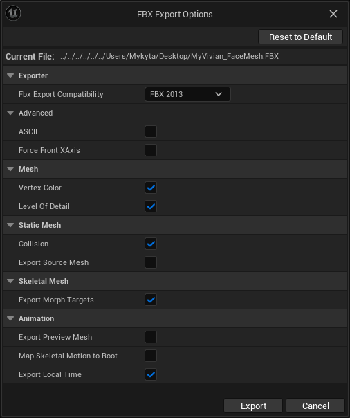
      </p>
   </a>  

2. The DNA file. It's usually found in the Quixel Bridge asset folder. By default, look in 
   - `C:\Users\<USER_NAME>\Documents\Megascans Library\Downloaded\UAssets\<ASSET_ID>\Tier0\asset_ue\MetaHumans\<METAHUMAN_NAME>\SourceAssets`).

   <a href="./images/get_original_dna.png">
      <p align="center">
         
      </p>
   </a>

3. Optionaly you may use the head from FBX file. **It is not recommended, but useful in certain cases listed in the [Import](#import) section**
   - `Content/Metahumans/<METAHUMAN_NAME>/Face/<METAHUMAN_NAME>_FaceMesh`
   - right-click on the corresponding skeletal mesh in the content browser Asset Actions - Export as FBX).
   - Convert FBX with [Autodesk FBX 2013 Converter](https://aps.autodesk.com/developer/overview/fbx-converter-archives). Do not ignore this step because otherwise, some data, such as shape keys, will be lost! The converter is not supported on Windows 11.

### Scene Setup
The first thing to do when opening a new scene in Blender is to set the units of measurement (this is necessary to match the units in Unreal Engine). The metric system should be selected with a Unit Scale = 0.01. If the units are not set up, the addon panel will display a **Setup Scene** button, which will configure the units as mentioned earlier.

### 1. Import
To import files, use the **"Import"** block on the N-panel of the addon (Object mode). Specify the path to the DNA file and the body FBX file. and click **"Import"**. The head mesh will be built from the DNA file. **"Morph Thresh."** propery defines a threshold to compare vertex position equality when computing morph target deltas (cut off very small deltas).

The import operation can take up to a few minutes. Afterwards, you will see two collections: "FBX_HEAD" and "FBX_BODY". The objects that are created in these collections are intended for further export as FBX files. Unlike previous versions, in Metareforge 1.1 each LOD of the head is represented by several objects. This helps in more conveniently editing individual objects in third-party applications, as well as more accurately transferring changes from the editable object to the objects intended for export to UE (for more details on transferring changes, refer to [section 2](#creating-edit-meshes-edit-armature-and-other-auxiliary-objects)). 


```eval_rst
.. note::

    If you want to import the head from FBX file you may untick "Build Head from DNA" and select head FBX file.

    Importing the head FBX files is recommended only in a few situations:

    - you are going to utilize your old edit meshes from Metareforge 1.0.X
    - you are going to edit a metahuman that has already been edited after importing it from Quixel Bridge.

    For all other cases, the "Build Head from DNA" option is preferred.
```
```eval_rst
.. warning::
    It's not recommended to import FBX files in any other way. The addon removes unnecessary elements, analyzes LODs, and assigns them to the corresponding internal properties (which can be viewed by expanding the "Head Objects" and "Body Objects" drop-down lists).
```
### 2. Creating Edit Meshes, Edit Armature, and Other Auxiliary Objects
Once the FBX files are imported, we can proceed to initialize auxiliary and editable objects. For this, we move to the **"Edit Shape"** block.

There are two parameters available:
- **Weld Distance:** Determines the distance (centimeters) at which the vertices of the meshes will be welded. The Weld Distance should be sufficient to weld all points at seams intended to be smooth, but at the same time, too large a Weld Distance value might cause other points to merge, making it impossible to apply the Surface Deform modifier, which is vital for subsequent processing. After initialization, you can preliminarily check the meshes for the most common issues that may arise during welding by clicking on the "Validate Edges" and "Validate Faces" buttons, which we will discuss a bit later in this section.

- **Keep Shape Keys for Edit Objects:** By default, this is turned on. You can turn it off to avoid storing shape key data for edit objects and to keep the blend file size manageable. However, in this case, you will not be able to edit corrective shape keys. Remember that the Metahuman LOD0 uses many corrective shape keys to achieve a more realistic appearance, and sometimes it's necessary to adjust some of these shape keys as well as the base mesh.

<a href="./images/initialized.png">
  <p align="center">
    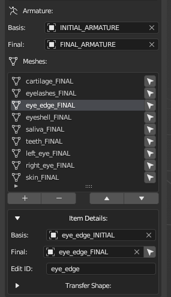
  </p>
</a>

To ensure clarity, let's review the terminology used in the addon:

- **Final Mesh:** a mesh tailored for editing. When editing the entire body, the head and body are joined, and all seams are welded.
- **Final Armature:** an armature created for editing. If the entire body is edited, the head and body skeletons are merged into one, removing all duplicates.
- **edit_id:** a tag that links Edit Meshes with the corresponding objects from the FBX collections, which will be exported to Unreal Engine. It is also necessary for the automatic adjustment of bones. For example the changes from the Final Mesh with `edit_id="skin"` will be transfered to the objects with `edit_id="skin"` from FBX_HEAD collection. Similarly the teeth bones will use only the Final Mesh with tag `"teeth"` to adjust their location etc.

Additionally, the add-on creates auxiliary Basis objects:
- **Basis Mesh:** a mesh intended to store the original shape of the mesh.
- **Basis Armature:** the initial skeleton.

**IMPORTANT:** It is advised not to alter these objects unless absolutely necessary. In a standard workflow, these objects do not require any manual editing.

After clicking on "Initialize", you will see the Final Armature and Basis Armature have already been assigned, as well as a list of various parts of the metahuman. By clicking on the arrow in each item of the list, you can select the Final Mesh for the corresponding body part. Expanding the 'Item Details', you can see the assigned Final and Basis meshes for each body part, as well as their edit_id. All these parameters are filled in automatically.

### 3. Switch Between Object Groups
Use the **"View"** block at the top of the menu to switch between LODs and editable objects.
<a href="./images/view.png">
  <p align="center">
    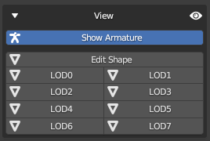
  </p>
</a>

### 4. Editing the Mesh
Once the auxiliary objects are initialized, you can start editing the mesh. Blender offers a wide range of editing capabilities, but if you need more, you can export the Final Mesh and edit it in an external editor.

**It's crucial to remember:**
- The topology and vertex indexing must remain UNCHANGED.
- Always disable symmetry when working in Edit Mode. At first glance, it may seem that it does not work anyway, but in reality, it sometimes snaps individual points, which can result in unwanted cavities or spikes.

Even considering that there are now many different objects, this does not mean that each one needs to be manually edited. 

#### 4.1. Editing the main objects (skin, teeth, eyes)
We can recommend the following course of action:

- Position the eyes and the teeth meshes according to your sketch or simply where you, as an artist, see them fitting.
- If you have moved the objects in Object Mode, don't forget to apply the transformations (`Ctrl + A -> All Transforms`).
Next, in Sculpt Mode (enable x symmetry if you need), you can work on the skin model. I prefer to start with the Grab and Elastic Deform brushes at the initial stage. I recommend starting with sculpting because only then can you properly use symmetry. In Edit Mode, symmetry does not work as expected due to the fact that Metahuman has asymmetry.
- By combining Edit Mode and Sculpt Mode, you can add more details.

```eval_rst
.. note::
    Editing the mesh with a large number of shape keys may be laggy when using some sculpt brushes. You can create a "light" duplicate of the problem mesh using the "Create Light Duplicate" feature from MetaReForge.Extras. After editing, transfer the deformations back to the original "FINAL" mesh similar to 4.3. Editing in third party application *
```
[* 4.3. Editing in third party application](#43-editing-in-third-party-application)

#### 4.2. How to transfer defromation from one edit object to another (eyeshels, eyelashes etc.)

Once the main meshes (skin, eyeballs, teeth) have been edited, you can proceed to edit the auxiliary meshes. MetaReForge offers a feature called "Align Minor Meshes" to somewhat simplify this process.

<a href="./images/align_minor_meshes.png">
  <p align="center">
    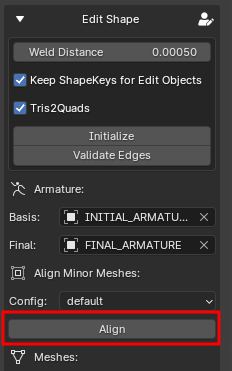
  </p>
</a>

Two configuration files are presented. Usually, the default one works well. If one or more eyelashes stray far from the main meshes, try using default_eyelashes_fix. Using these configuration files, changes identified with the skin will be transferred to objects with the next edit IDs: "eyeshell", "eyeEdge", "eyelashes", and "cartilage".The changes to "teeth" will be transferred to "saliva". Optionally, you can create custom configuration files.

#### 4.3. Editing in third party application:
If you wish to modify any part of the body in an external application, you will need to export the necessary Final Mesh and then, after editing, import it back into Blender.
Then:
- Apply transforms (ofter newly imported mesh has nonzero transforms)
- Use "Transfer Basis Coordinates" operator from MetaReForge.Extras. Select the newly imported mesh, then select original "FINAL" mesh created by MetaReForge and click the button. The operator updates only vertex coordinates of the basis shape keepeng the remaining information (like bone weights, shape key deltas unchanged)

<a href="./images/transfer_basis_coordinates.png">
  <p align="center">
    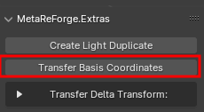
  </p>
</a>

### 5. Editing the Armature
After achieving the desired mesh shape, it's necessary to adjust the skeleton to these changes. The Metahuman skeleton contains about a thousand bones, and editing it manually is tedious and time-consuming. Therefore, our addon includes tools to simplify this routine by transferring the deformation from the final mesh to the skeleton.

To start editing the skeleton, you need to select it and switch to edit mode. If everything is done correctly, you will see the necessary tools in the MRF section on the N-panel.

We recommend using the automatic armature adjustment algorithm (**Auto-Fit -> Auto**). **Advanced Fit** tab is more for non-metahuman skeletons and for handling problematic situations where the automatic algorithm does not work.

### 6. Facial Expression Testing Using Control Rig in Blender

<a href="./images/face_ctrls.png">
  <p align="center">
    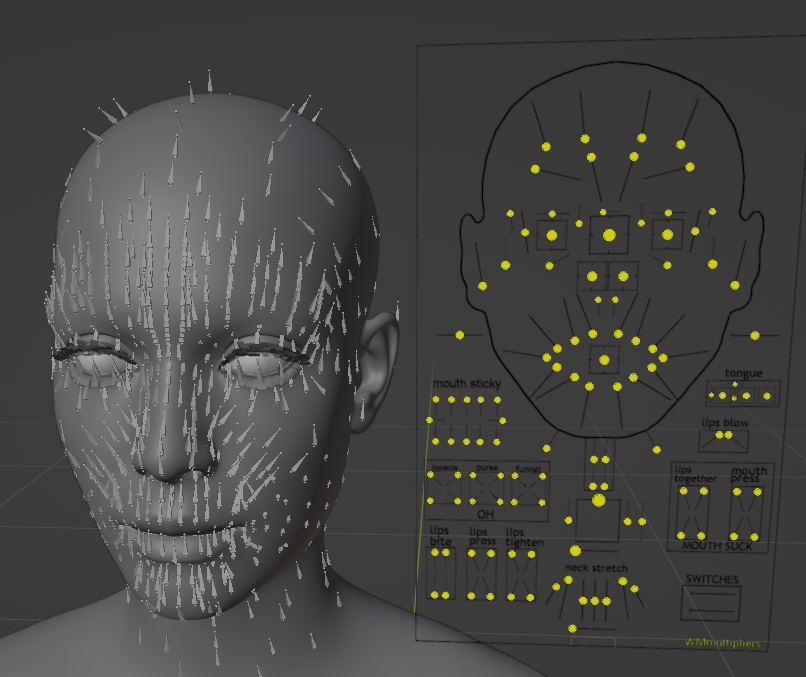
  </p>
</a>

Now, it's possible to approximately test how facial animations will look in Unreal Engine directly in Blender. This significantly saves time, as importing into Unreal Engine takes a considerable amount of time.

```eval_rst
.. important::
    - This functionality is intended exclusively for testing facial animations with subsequent export of models to Unreal Engine.
    - The final facial expressions in Unreal Engine may differ slightly.
    - This solution is not optimized for real-time use.
    - The data required for the control rig to work is **temporary**. When loading a new blend file or restarting Blender, the control rig needs to be initialized again.
```

#### 6.1. Initializing the Controls
To initialize the control rig, open the **MetaReforge.FaceControls** menu on the N-panel and press the **"Init Rig Logic"** button. An Armature Object named `MRF_CTRL_RIG` will be created, through which control will be exercised similarly to the corresponding control rig in Unreal Engine. Clicking the **"Edit Pose"** button will enter you into Pose Mode for this object (this can also be done manually). Most controls work, but not all.
The recalculation of changes in bone positions, etc., requires a lot of resources, so it can be turned off when not needed by clicking the **"Turn OFF Rig Logic"** button and then, when necessary, re-enable calculations by clicking **"Turn ON Rig Logic."**

#### 6.2. Tuning Corrective Shape Keys (Morph Targets)
For a setup of corrective shape keys, it's necessary to identify the facial expression you wish to adjust. Then, in the **"MetaReforge.FaceControls"** menu, display all non-zero shape keys by clicking on the **"Refresh nonzero shape keys"** button (_**1**_, see figure), which lists all the non-zero shape keys for the given facial expression. When changing the facial expression, the button must be pressed again to refresh the information.

Next, click on the edit icon or the sculpt icon next (_**2**_, see figure) to enter edit mode or sculpt mode preconfigured for editing the particular shape key.

Optionally you may also disable rig logic (_**3**_, see figure). This may be necessary to improve performance during editing, as the enabled rig logic significantly reduces performance.

After completing the editing, you can include the shape key to the syncronization list by clicking the checkmark button (_**4**_, see figure). 
Then you can return to the control rig (click the **"Edit Pose"** button) and check how the face animates with the updated shape key or do the next steps of the workflow from the object mode.

```eval_rst
.. important::
    Metahumans use corrective shape keys only at LOD0.
```


<a href="./images/corrective_sk.png">
  <p align="center">
    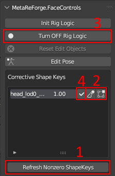
  </p>
</a>

### 7. Cloth
In version 1.1, we've added the ability to adjust standard Metahumans clothing to updated meshes. The process is straightforward:

- **Exporting Clothing from Unreal Engine.** First, you need to export the desired clothing item from Unreal Engine. In the Content Browser, clothing is located at `Content/Metahumans/Common/<SEX>/<HEIGHT>/<WEIGHT>/....`. However, it's easier to find the clothing associated with a specific Metahuman through its blueprint (`Content/Metahumans/<METAHUMAN_NAME>/BP_<METAHUMAN_NAME>`).
Select the desired clothing item from the `Components` list. Then, in `Details` - `Mesh`, navigate to the skeletal mesh in the content browser.
   <table border="0" align="center">
      <td>
         <a href="./images/cloth_components.png">
            <p align="center">
               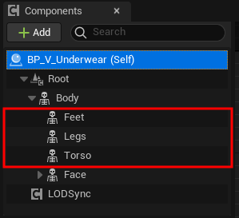
            </p>
         </a>
      </td>
      <td>
         <a href="./images/cloth_details.png">
            <p align="center">
               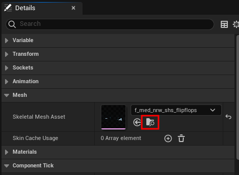
            </p>
         </a>
      </td>
   </table>
   
- **Export** the clothing as FBX in the same way you previously exported the body.
- **Importing Clothing into Blender**. In the Cloth section, set the path to the FBX file and click **"Import"**. You are allows you to import multiple clothing items, just repeat the import for another cloth FBX.
   <a href="./images/cloth_components.png">
      <p align="center">
         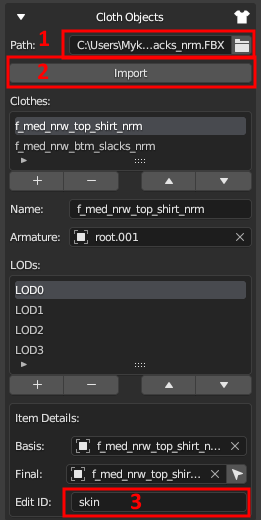
      </p>
   </a>
- In the details, the Edit ID should be "skin." This indicates that deformations will be transferred to the clothing from the Edit Mesh with the same Edit ID.
- Deformations will be transferred to the clothing via the "Update Original" tab (if the Cloth button is pressed). [See section 8](#applying-changes-to-exportable-objects)
- Exporting clothing is done through the general Export tab (if the Cloth button is pressed). [See section 9](#export)

### 8. Applying Changes to Exportable Objects
#### 8.1. Synchronization (Transferring Changes to the Exportable Objects)
When the creative part of the work is completed, it's necessary to transfer all changes to the exportable models. For this, we go to the **"Update Original"** block. By clicking on the **"Synchronize"** button, changes from the Final Mesh (more precisely, the difference between the Final Mesh and the Initial Mesh) will be applied to the individual LODs, and the updated position of the bones will also be applied to the original armature objects.

<a href="./images/update_original.png">
  <p align="center">
    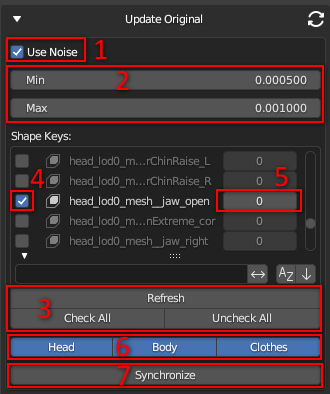
  </p>
</a>

- **Use Noise (1, see fig. above):** Default is True. It introduces a small amount of noise to the vertex positions at the time of binding. The Surface Deform modifier, which this operator is based on, fails to work if the vertex positions are identical. The noise value is usually extremely small, making its visual impact imperceptible, but it's sufficient for the Surface Deform algorithm to bind successfully.
- **Min, Max (2, see fig.):** The minimum and maximum values of the noise in centimeters. These should only be increased if synchronization fails with standard settings. However, I recommend trying to press **Synchronize** again or several times in case of failure. Due to the random nature of the process, there's a good chance of achieving a noise configuration that allows smooth synchronization even without changing parameters.
- **Updating the shape key list (3, see fig.)**: Several options are available for updating the shape key list. **Refresh** - updates the list of keys while preserving their original values. It is recommended to use this when some keys have already been set (for example, marked from the nonzero [shape keys list](#tuning-corrective-shape-keys-morph-targets)). **Check All** - updates the list of all keys and marks them for subsequent synchronization. **Uncheck All** - does the same but disables all keys.
- **Enable/Disable Transferring Shape Key (4, see fig.)**: The checkbox to the left of the key name enables or disables synchronization of that key. 
- **Max LOD (5, see fig.)**: The number to the right of the key name indicates the maximum LOD with which this key will be synchronized. For example, all corrective morph targets for a Metahuman face exist only for LOD0, so the corresponding field is marked with 0, meaning this Morph target will only be transferred to LOD0. If you want to create your custom key and transfer it to all LODs, you can do so. For instance, if 5 is specified in the corresponding field, the key will be transferred to LODs from 0 to 5.
- **Enable/Disable Transferring Targets (6, see fig.).** By default the deformation are transfered to all types for objects (head, body, cloth) but you are allowed to enable/disable any of them.

After applying the changes, you can review the results. For convenience, there is a **"View"** block at the top of the panel, where you can switch between LODs and editable objects. There may be minor imperfections, which can be corrected manually.

#### 8.2. Re-Computing Normals
It's important to pay attention to the seam between the head and body and also to the seams along the UV unwrap, as Metahuman actually has mesh splits at the UV seams. If sharp edges are noticeable, normals need to be recalculated, and we have developed a specific function for this.

After clicking on **"Re-Compute Split Normals"**, the following will occur:

1. If Align Vertices is enabled, all points that are closer than the Weld Distance will be merged into one position.
2. Normals will be recalculated as if all seams are welded.

With **Weld Distance** (in centimeters), you can control this process, but the default value is chosen to work in most cases. With a Weld Distance of more than 0.01, you might start to see points welding together that shouldn't be.

**Remember**, excessive Weld Distance can result in unintended merging of points, so it should be used cautiously.


### 9. Export
Once all LODs look as desired, it's time to export them for use in Unreal Engine. Go to **"Export"* block
#### 9.1. FBX
Based on my experience, I prefer to export LODs separately because this way, you don't have to spend a lot of time configuring Material Slots in Unreal Engine. Following this logic, we have a utility for exporting. You just need to specify the path (and the name if default is not OK) and click **"Export FBX"**. There's no need to worry about settings, selecting the right objects, etc. Everything will be done for you. As a result, you should see 8 LODs for the head and 4 LODs for the body in the folder, so you can upload these files to Unreal Engine.
By default all types for objects (head, body, cloth) are exported but you are allowed to enable/disable any of them.
#### 9.2. DNA
The Metahuman Animation blueprint heavily relies on the DNA file. Therefore, if you want your custom Metahuman to retain the ability to perform realistic facial animations, updating the DNA file is an ESSENTIAL step.
Note: If you don't see the necessary functionality in the **"DNA Update"** block, check the Installation Guide.

All you need to do is:

- Make sure the path to the original DNA file is specified at the Import block.
- Make sure the output path is specified (it uses the same directory as the FBX).
- Click **"Modify DNA"**. MetaReForge will record the actual positions of the bones from Blender into the DNA file (Neutral Joint Translations and Rotations, following Epic Games' terminology).
- To assign the updated DNA file to a Metahuman in Unreal Engine, you need to drag and drop it into the Content Browser and select the relevant Skeletal Mesh.

For troubleshooting, check out to our [Discord Server](https://discord.gg/qYtEq2ukDX).